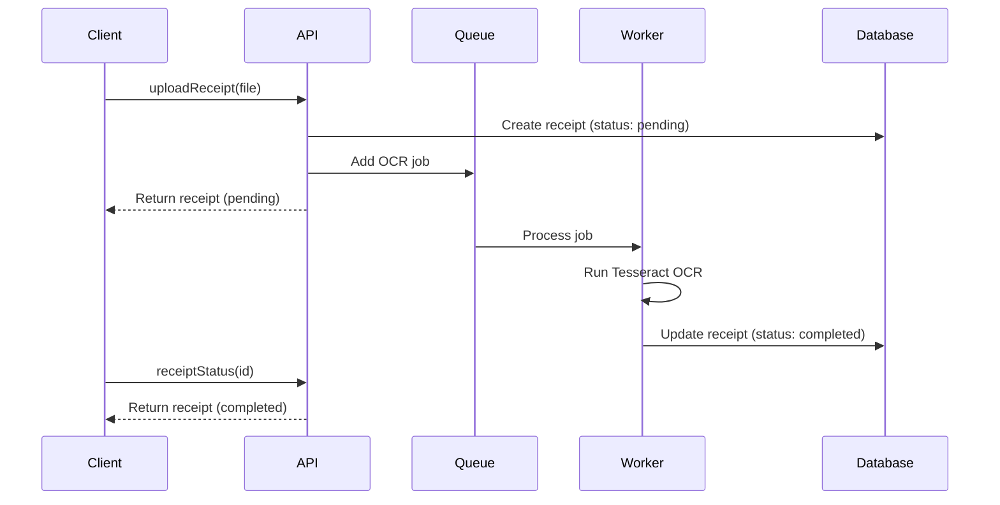

#  Receipt OCR Backend

A high-performance GraphQL API for processing and managing receipts using OCR (Optical Character Recognition) technology. This scalable backend service enables users to upload receipt images, extract structured data asynchronously, and perform advanced queries with filtering capabilities.

##  Key Features

- **Asynchronous OCR Processing**
  - Background job processing with BullMQ and Redis Cloud
  - Automatic retry mechanism (3 attempts with exponential backoff)
  - Real-time status tracking (pending → processing → completed/failed)
  - Manual retry capability for failed receipts
  - Scalable architecture with 5 concurrent workers

- **OCR-Powered Receipt Processing**
  - Image upload support (JPG, PNG)
  - Text extraction using Tesseract.js
  - Structured data parsing (store, date, items, totals)
  - Status tracking and error handling

- **Advanced Querying**
  - Filter by store name (case-insensitive, partial match)
  - Date range filtering
  - Combined filter conditions
  - Pagination-ready architecture

- **Modern Tech Stack**
  - **Runtime**: Node.js 18+ with TypeScript
  - **API**: Apollo Server 4 (GraphQL)
  - **Database**: PostgreSQL with Prisma ORM
  - **Queue**: BullMQ with Redis Cloud
  - **OCR**: Tesseract.js
  - **File Handling**: Stream-based processing

## Quick Start

### Prerequisites
- Node.js 18 or higher
- PostgreSQL 13+
- Redis Cloud account (or local Redis instance)
- npm or yarn

### Installation

1. **Clone and install dependencies**
   ```bash
   git clone https://github.com/nati3514/receipt-ocr-backend.git
   cd receipt-ocr-backend
   npm install
   ```

2. **Configure environment**
   ```bash
   cp .env.example .env
   # Update .env with your database and Redis credentials
   # Required environment variables:
   # DATABASE_URL="postgresql://..."
   # REDIS_HOST=redis-xxx.cloud.redislabs.com
   # REDIS_PORT=12345
   # REDIS_PASSWORD=your_redis_password
   ```

3. **Initialize database**
   ```bash
   npx prisma generate
   npx prisma migrate dev --name init
   ```

4. **Build the application**
   ```bash
   npm run build
   ```

5. **Start the server**
   ```bash
   npm start
   ```
   Access the GraphQL Playground at `http://localhost:4000/graphql`

6. **For development with auto-reload**
   ```bash
   npm run dev
   ```

## API Documentation

### GraphQL Endpoint
```
POST /graphql
Content-Type: application/json
```

### Example Queries

#### 1. Upload Receipt (Asynchronous)
```graphql
mutation UploadReceipt($file: Upload!) {
  uploadReceipt(file: $file) {
    id
    status        # pending, processing, completed, or failed
    imageUrl
    errorMessage  # Only present if status is failed
    createdAt
  }
}
```

#### 2. Check Receipt Status
```graphql
query GetReceiptStatus($id: ID!) {
  receiptStatus(id: $id) {
    id
    status
    storeName
    purchaseDate
    totalAmount
    items {
      name
      price
      quantity
    }
    errorMessage
    updatedAt
  }
}
```

#### 3. Retry Failed Receipt
```graphql
mutation RetryReceipt($id: ID!) {
  retryReceipt(id: $id) {
    id
    status
    errorMessage
  }
}
```

#### 2. Filter Receipts
```graphql
query GetReceipts($filter: ReceiptFilter) {
  receipts(filter: $filter) {
    id
    storeName
    purchaseDate
    totalAmount
    items {
      name
      price
      quantity
    }
  }
}
```

**Filter Variables Example:**
```json
{
  "filter": {
    "storeName": "walmart",
    "startDate": "2023-11-01T00:00:00Z",
    "endDate": "2023-11-30T23:59:59Z"
  }
}
```

##  Project Structure

```
receipt-ocr-backend/
├── src/
│   ├── index.ts            # Server configuration
│   ├── resolvers.ts        # GraphQL resolvers
│   ├── schema.graphql      # Type definitions
│   ├── services/
│   │   ├── ocr.service.ts  # Business logic
│   │   └── queue/
│   │       ├── ocr.queue.ts    # BullMQ queue configuration
│   │       └── ocr.worker.ts   # Background worker
│   ├── config/
│   │   └── redis.ts        # Redis connection
├── prisma/
│   └── schema.prisma      # Database schema
├── uploads/               # Receipt storage
├── test/                  # Test suite
└── README.md             # This file
```

## Testing

Run the test suite:
```bash
npm test
```

## Production Deployment

1. **Build the application**
   ```bash
   npm run build
   ```

2. **Set production environment**
   ```bash
   export NODE_ENV=production
   ```

3. **Run migrations**
   ```bash
   npx prisma migrate deploy
   ```

4. **Start the server and worker**
   ```bash
   # Start API server
   npm start
   
   ```

## How It Works

### Asynchronous Processing Flow



## Monitoring and Maintenance

### Queue Management
- Monitor your Redis Cloud queue at: [Redis Cloud Console](https://cloud.redis.io)
- Queue name: `ocr-queue`
- Default concurrency: 5 jobs
- Automatic retries: 3 attempts with exponential backoff

### Logging
Check server logs for:
- `✅ Connected to Redis Cloud` - Successful Redis connection
- `📋 OCR Queue initialized` - Queue ready to accept jobs
- `👷 OCR Worker started` - Worker is running
- `🔄 Processing OCR` - Job started
- `✅ OCR completed` - Job successful
- `❌ OCR failed` - Job failed (check error details)

## Frontend Integration Example

### Polling for Status
```javascript
const { data, stopPolling } = useQuery(GET_RECEIPT_STATUS, {
  variables: { id: receiptId },
  pollInterval: 2000, // Poll every 2 seconds
  skip: !receiptId,
});

// Stop polling when done
useEffect(() => {
  if (['completed', 'failed'].includes(data?.receiptStatus?.status)) {
    stopPolling();
  }
}, [data]);
```

## Troubleshooting

### Common Issues
1. **Redis Connection Failed**
   - Verify Redis Cloud credentials
   - Check network connectivity to Redis host
   - Ensure Redis instance is running

2. **OCR Jobs Not Processing**
   - Verify worker is running: `npm run worker`
   - Check Redis connection
   - Monitor server logs for errors

3. **Failed Jobs**
   - Check `errorMessage` field on receipt
   - Use `retryReceipt` mutation to retry
   - Review server logs for detailed error information

